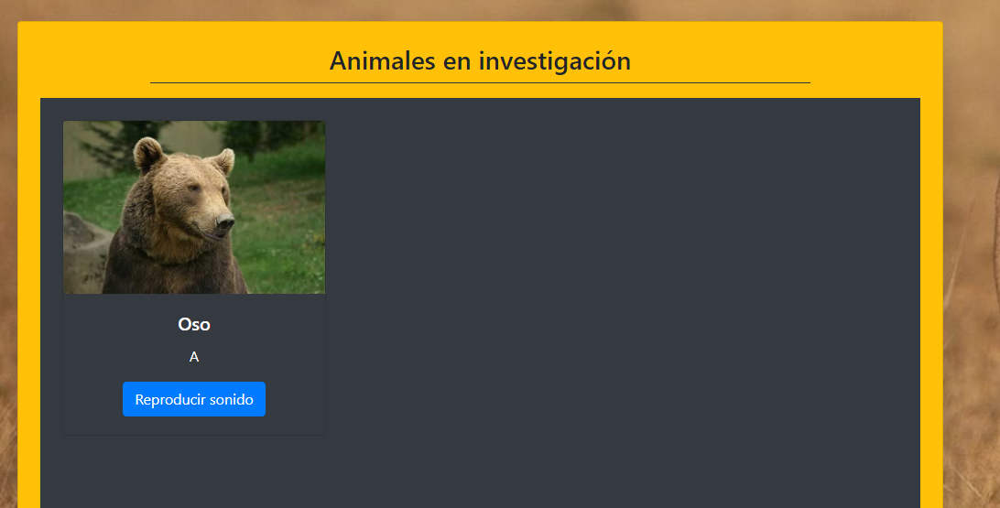

Prueba - Programación avanzada en JavaScript

Descripción
Página Web de investigaciones de animales, los cuales deben mostrarse en pantalla al llenar el formulario, y luego al "Agregar" debe llevarlos a el apartado de animales en investigación, reproducir su sonido y mostrar foto.

Visuales

Actualmente no muestra el detalle del animal, solo genera la tarjeta con el boton reproducir sonido.

Autores
Katherine Medina